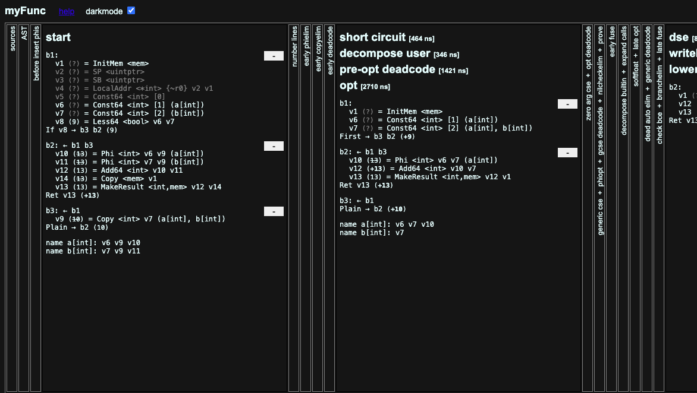
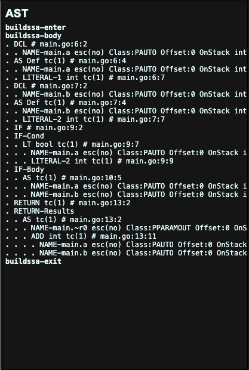
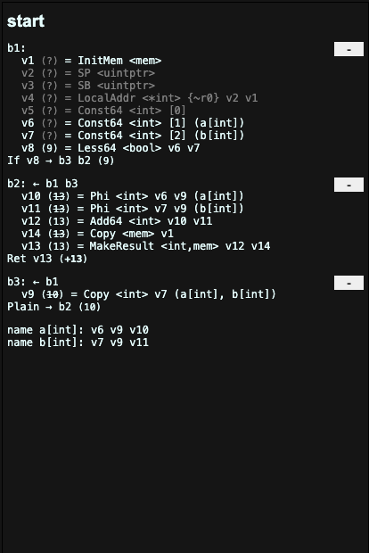
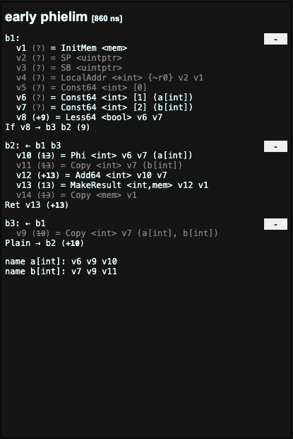

# How_gc_Works
This aims to provide Go developers with an overiew of the inner workings of gc. 

The gc code: https://github.com/golang/go/tree/master/src/cmd/compile

## 0. Define a function
We're going to define the function for the sake of simplicity to look at its AST and SSA

```
package main

import "fmt"

func myFunc() int {
	a := 1
	b := 2

	if a < 2 {
		a = b
	}

	return a + b
}

func main() {
	fmt.Println(myFunc())
}
```

```
GOSSAFUNC=myFunc go tool compile main.go
```

This invocation will generate ssa.html. If you open it in your browser, you'll see something like this.


<br>


## 1. Lexical Analysis and Syntax Analysis
The compiler analyzes the source code and converts it into a form that can be easily processed.

The corresponding code for this step; https://github.com/golang/go/tree/master/src/cmd/compile/internal/syntax

## 2. Abstract Syntax Tree (AST)
The AST is a tree-like data structure that represents the structure of a program's source code in a more abstract way. This step involves constructing the AST from the parsed source code.

AST is something like this.



The corresponding code for this step: https://github.com/golang/go/tree/master/src/cmd/compile/internal/gc
## 3. Static Single Assignment (SSA) Form
SSA form is a way of representing a program's control flow in a more structured way, making it easier to perform optimizations. This step involves converting the AST into SSA form. 

Unoptimized SSA is something like this.



In b1 block, `v6` and `v7` is the assignment of 1, 2 to a, b. And `If v8 -> b3 b2` is to decide whether to jump program execution to either `b2`(if true) or `b3`(if false).

The corresponding code for this step; https://github.com/golang/go/tree/master/src/cmd/compile/internal/gc
## 4. SSA Optimization
This step involves performing various optimizations on the code in SSA form to improve its performance. These optimizations can range from simple dead code elimination to more complex techniques like loop unrolling.

Optimized SSA is something like this.



In the optimized version, the unnecessary memory allocation, initialization, and copying operations have been removed. Instead, the local variables have been directly referenced by their names. Also, the function arguments have been directly used instead of being stored in local variables. Furthermore, the unnecessary variables `v9` and `v11` has been removed, and the variables `v10` and `v12` have been replaced with constant values.

The corresponding code for this step; https://github.com/golang/go/tree/master/src/cmd/compile/internal/ssa
## 5. Machine code for a given target
Finally, the optimized code is compiled into machine code that can be executed on a specific target platform.

The corresponding code for this step (for the x86 architecture); https://github.com/golang/go/tree/master/src/cmd/compile/internal/x86
